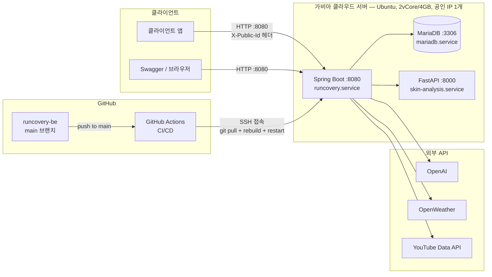

# RunCovery

러닝을 시작하기 막막한 사람을 위한 AI 웰니스 러닝 코치 서비스입니다. 프로필과 목표를 입력하면 AI가 미래 목표 장면과 주간·일일 훈련 계획을 짜주고, 러닝이 끝나면 그날의 컨디션·피부 상태·날씨까지 종합해 맞춤 리포트와 처방전을 내려줍니다.

## 기획 배경

러닝 인구 1000만 시대지만, 나이키런클럽처럼 기존 러닝 앱은 거리·시간·페이스·칼로리 같은 "기록"에만 집중하고 러닝 후 관리는 온전히 사용자 몫으로 남아 있습니다. 문제는 관리의 필요성을 모르는 게 아니라 **오늘의 나에게 무엇이 필요한지 모른다는 것**입니다 — 땀을 많이 흘렸으면 수분을 얼마나 보충해야 하는지, 다리가 뻐근하면 쉬어야 하는지 스트레칭을 해야 하는지, 잠을 적게 잤으면 오늘 강도를 낮춰야 하는지 판단할 기준이 없습니다.

RunCovery는 러닝 전후 관리까지 연결된 경험을 제공합니다. 러닝 데이터·컨디션·피부 스캔을 바탕으로 AI가 수분/영양 보충, 피부 케어, 수면 케어를 그날그날 개인화해 처방합니다.

## 사용자 흐름

1. **데이터 수집** — 나이, 성별, 키, 몸무게, 운동 경험, 러닝 목표 입력
2. **오늘의 컨디션 체크** — 수면 시간, 몸 상태, 통증 여부, 피로도로 오늘의 러닝 계획 조정
3. **AI 러닝 플랜 생성** — 목표 기간과 현재 운동 수준을 분석해 개인 맞춤 계획 생성
4. **사후 관리** — 러닝 종료 후 피부 스캔, 피로도, 땀 분비, 통증 부위, 운동 만족도 입력
5. **회복 리포트 제공** — 피부 관리·수분/영양 섭취·수면 추천·통증 관리 영상 등 맞춤 처방전 제공

## 비즈니스 모델 (확장 계획)

현재 기능 범위는 아니지만, 러닝·컨디션 데이터를 분석하는 AI 개인화 엔진을 기반으로 다음과 같은 확장을 그리고 있습니다.

- **AAC 자사 제품·프로그램 크로스셀링**: 웰니스 처방전 안에서 사용자에게 필요한 AAC 수분/피부/스트레칭 제품·프로그램을 추천해 구매로 연결
- **오프라인 러닝 스테이션 기술 지원**: 러닝 후 피부 분석 기술을 오프라인 러닝 스테이션(팝업, 러닝크루 거점 등)에 기술 지원 형태로 제공

러닝을 새로운 고객 접점으로 삼아, AI 개인화 웰니스 경험과 AAC의 기존 사업을 연결하는 것이 목표입니다.

## 주요 기능

**목표 설정**
- 프로필/계획 기반 미래 목표 장면 AI 추천, 목표 수치 추천
- 주간 목표 자동 생성(최근 7회 러닝 기록 반영) 및 갱신

**일일 루틴**
- 오늘의 컨디션 체크 및 AI 분석
- 날씨·컨디션·주간목표 기반 일일 미션 AI 생성
- 러닝 데이터 동기화 시 오늘 미션 자동 완료 처리
- 통증 부위 기록/조회

**웰니스**
- AFTER_RUN / AFTER_CARE 피부 스캔 및 날짜별 기록 조회
- 전날 대비 AFTER_CARE 피부 점수 비교
- 러닝·날씨·피부·컨디션·설문 기반 AI 웰니스 리포트 생성
- 리포트 기반 수분/피부/스트레칭 처방전 및 통증 부위 기반 YouTube 회복 영상 추천
- 처방전 완료 상태 관리

**마이페이지 / 홈**
- 주간 활동 통계, 사후관리 달성률, 이번달 피부 점수 그래프
- 홈 화면 목표 달성률 및 AI 웰니스 팁

## 기술 스택

| 영역 | 사용 기술 |
|---|---|
| Backend | Spring Boot 4.1, Java 21, Spring Data JPA |
| DB | MariaDB |
| AI | Spring AI + OpenAI (목표·미션·컨디션·웰니스 리포트 생성, 홈/마이페이지 AI 피드백) |
| 얼굴/피부 분석 | FastAPI + OpenCV + MediaPipe ([runcovery-skin-analysis](https://github.com/runcovery/runcovery-skin-analysis), 별도 저장소) |
| 외부 API | OpenWeather(날씨), YouTube Data API(회복 영상) |
| API 문서 | springdoc-openapi (Swagger UI) |
| 배포 | 가비아 클라우드 (Ubuntu 22.04, 2vCore/4GB) |
| CI/CD | GitHub Actions (main push 시 자동 배포) |

## 아키텍처

서버 1대(가비아 클라우드) 안에 Spring Boot·MariaDB·FastAPI 3개 서비스가 systemd로 함께 떠 있는 구조입니다. 외부에는 22(SSH)·8080(API)만 열려 있고, DB(3306)와 얼굴분석 서버(8000)는 서버 내부(`127.0.0.1`)에서만 접근 가능합니다.

**공개 vs 내부 전용**

| 구분 | 포트 | 설명 |
|---|---|---|
| 외부에 열림 (보안그룹 + ufw) | 22 (SSH), 8080 (Spring Boot) | 인터넷에서 접근 가능한 포트는 이 두 개뿐 |
| 서버 내부에서만 접근 (`127.0.0.1`) | 3306 (MariaDB), 8000 (FastAPI) | Spring Boot가 같은 서버 안에서 localhost로만 호출, 외부 포트는 열지 않음 |

> 단일 서버 구조: 지금은 편의상 서버 한 대에 API·DB·얼굴분석을 모두 몰아넣은 상태라, 이 서버가 죽으면 세 서비스가 같이 죽습니다. 트래픽이 늘어나면 DB나 FastAPI를 별도 서버로 분리하는 걸 고려할 것.

## 배포

가비아 클라우드 서버에 `main` 브랜치 기준으로 배포되며, `main`에 push되면 GitHub Actions가 자동으로 서버에 접속해 최신 코드를 반영합니다. 배포 서버 주소는 팀 내부에서 별도 공유합니다.

## 팀

| 도메인 | 담당 |
|---|---|
| User / Goal / BodyIssue | [임준기](https://github.com/limjungi) |
| Mission / Condition / Activity / Home / 마이페이지 | [김소진](https://github.com/JiniiW) |
| Wellness (피부 스캔 / 리포트 / 처방전) | [김주영](https://github.com/juyoungk1) |
